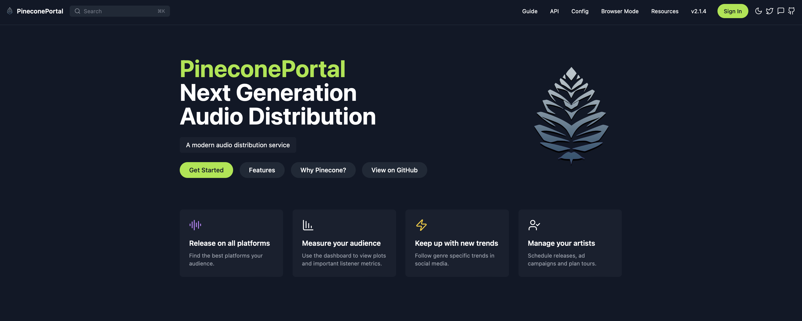

# React+Vite Web Template 2024



Ship a site fast af.
Responsive generic React-Vite-Tailwind boilerplate website  à la 2024. Noticed how all sites look identical? Well, now yours can too! Includes basic templates for:

- User login with third party
- Terms of Service & Privacy Policy
- Mobile responsiveness

"Wow I didn't know it was this easy to set up!"

````
npm install
npm run dev
````

Just smack your logo in there, use an LLM to generate some content, and send an invoice to your client. Don't forget to update ToS and Privacy Policy. 

---

### Set up user registration with Supabase

[Supabase](https://supabase.com/docs)

[OAuth 2.0: authenticate users with Google ](https://developer.chrome.com/docs/extensions/how-to/integrate/oauth)

